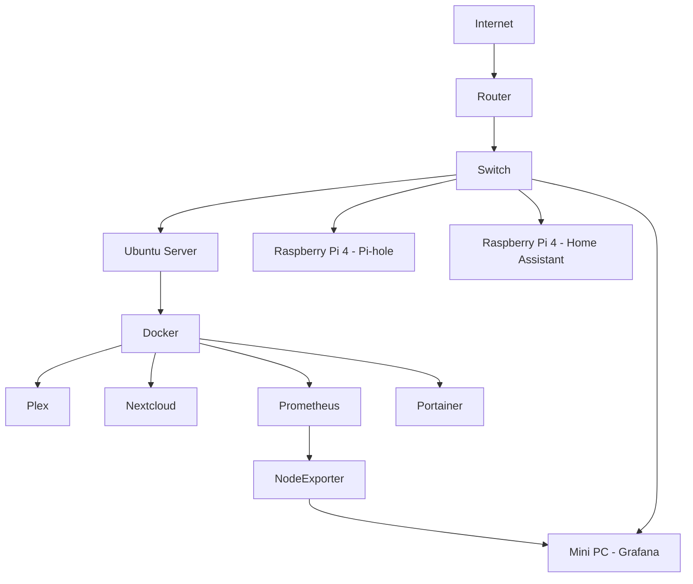
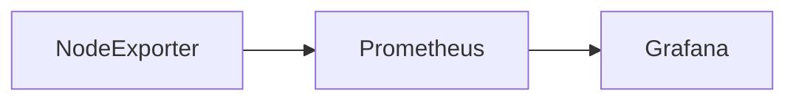
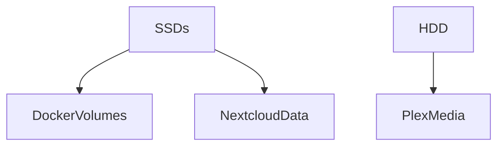

# home-server
# 🏠 Home Server / Homelab Project Documentation

**Author:** CB
**Repository Purpose:** Reference, replication, learning, and portfolio evidence

---

## 1. Project Overview

This repository documents the complete build of a personal **home server / homelab**. The goal of the project was to create a modular, low‑cost server environment that could:

* Host media services (Plex)
* Provide personal cloud storage (Nextcloud)
* Deliver network‑wide DNS filtering (Pi‑hole)
* Monitor system health and performance (Grafana + Prometheus)
* Act as a practical learning platform for Linux, Docker, networking, and DevOps concepts

All services were designed to be **containerised, isolated, and easy to rebuild**.

---

## 2. High‑Level Architecture

### Logical Architecture Diagram (Mermaid)



---

## 3. Hardware Inventory

### Main Server

* Repurposed desktop PC
* **OS:** Ubuntu Server
* **CPU:** x86_64
* **RAM:** 16GB
* **Storage:**

  * 1TB HDD (Plex media)
  * 2 × 512GB SSD (Docker volumes, Nextcloud data, backups)
* **Network:** Gigabit Ethernet

### Raspberry Pi Nodes

* **3 × Raspberry Pi 4B**

  * Pi #1 → Pi‑hole (DNS)
  * Pi #2 → Home Assistant OS
  * Pi #3 → Reserved for labs / automation

### Mini PC

* **RAM:** 4GB
* **OS:** Linux
* **Purpose:** Monitoring stack (Grafana + Node Exporter)

### Networking Hardware

* ISP Router
* 2 × Linksys LGS108 unmanaged gigabit switches
* Ethernet‑only server connectivity

---

## 4. Software Stack

### Base Platform

* Ubuntu Server
* Docker
* Docker Compose (plugin)

### Services Deployed

| Service       | Purpose                   |
| ------------- | ------------------------- |
| Plex          | Media streaming server    |
| Nextcloud     | Personal cloud storage    |
| Pi‑hole       | Network‑wide DNS blocking |
| Grafana       | Monitoring dashboards     |
| Prometheus    | Metrics collection        |
| Node Exporter | Host system metrics       |
| Portainer     | Docker web UI             |

---

## 5. Build Process (Chronological)

### Step 1 – Ubuntu Server Installation

1. Created a bootable USB installer
2. Installed Ubuntu Server (minimal)
3. Enabled OpenSSH during install
4. Updated system:

```bash
sudo apt update && sudo apt upgrade -y
```

---

### Step 2 – Storage Configuration

Mounted drives under `/mnt` and standardised layout:

```
/mnt
 ├── media/plex
 ├── docker
 └── backup
```

Permissions fixed for Docker:

```bash
sudo chown -R cb:cb /mnt
```

---

### Step 3 – Docker Installation

```bash
sudo apt install docker.io docker-compose-plugin -y
sudo usermod -aG docker cb
```

(Reboot required)

---

### Step 4 – Docker Services

Each service is deployed via Docker Compose.

#### Example: Plex

```yaml
services:
  plex:
    image: linuxserver/plex
    volumes:
      - /mnt/media/plex:/media
    ports:
      - "32400:32400"
```

Similar Compose files exist for:

* Nextcloud + MariaDB
* Prometheus
* Grafana
* Portainer

---

### Step 5 – Pi‑hole (DNS)

* Installed Pi‑hole on Raspberry Pi 4
* Router DNS updated to Pi‑hole IP
* Result: network‑wide ad & tracker blocking

---

### Step 6 – Monitoring Stack

**Mini PC**

* Node Exporter running on port `9100`

**Server**

* Prometheus scraping metrics
* Grafana dashboards configured

Verification:

```bash
curl http://<node-ip>:9100/metrics
```

---

## 6. Service Dependency Diagram



---

## 7. Storage Layout Diagram



---

## 8. Access Methods

| Method  | Purpose                    |
| ------- | -------------------------- |
| SSH     | Server management          |
| Web UI  | Plex, Grafana, Portainer   |
| SMB     | Media access from Windows  |
| Browser | Nextcloud & Home Assistant |

---

## 9. Security Considerations

* SSH access only
* No public internet exposure
* Docker container isolation
* DNS‑level protection via Pi‑hole
* Separated backup storage

---

## 10. Backup Strategy

* Docker volumes backed up manually
* External USB storage
* Planned automation via cron

---

## 11. Known Issues & Fixes

| Issue                 | Resolution                      |
| --------------------- | ------------------------------- |
| Nextcloud 503 errors  | Permissions & container restart |
| Docker name conflicts | Removed duplicate containers    |
| SMB access denied     | Fixed ownership & Samba config  |

---

## 12. Repository Structure

```
home-server/
├── README.md
├── docker/
│   ├── plex/
│   ├── nextcloud/
│   ├── grafana/
│   └── prometheus/
├── diagrams/
├── scripts/
└── backups/
```

---

## 13. Project Value

This homelab provides:

* A real‑world DevOps learning platform
* Portfolio‑ready technical documentation
* A personal cloud & media ecosystem
* A scalable foundation for future automation

---

**Status:** Active and extensible
